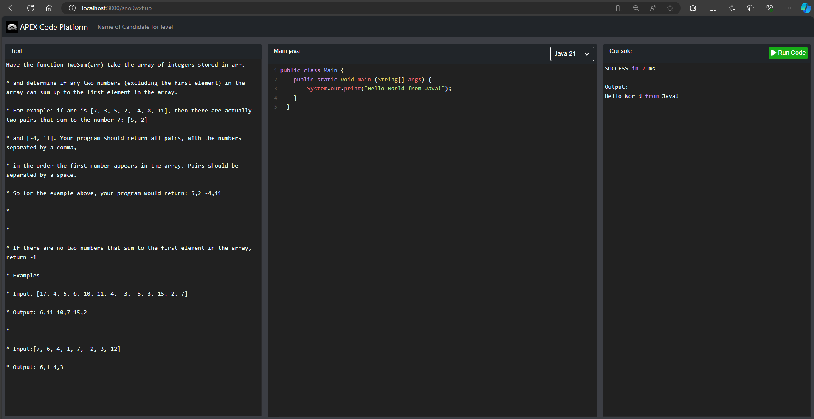

## Apex Coding Platform Front

This project is a tool for replace the current interview tools in Apex interviews

This frontend project tries to provide the minimal UI tools with all the necesary for a code interview

Main features:
* Multiple languaje support adding API endpoints, currently working with Java 21 and Python 3
* Real time update on multiple origins with the same URL

### `npm run start`

Runs the app in the development mode. 

## Use
Open [http://localhost:3000](http://localhost:3000) to view it in the browser.
Once open, UI will provide a random URL, sharing this URL you could see the coding in real time

### ToDo
* Update React dependencys
* Add pannel for Input values
* Add pannel for Test casses result
* Add user listeners
* Add test cases support
* Add interviewer - Interviewed info

